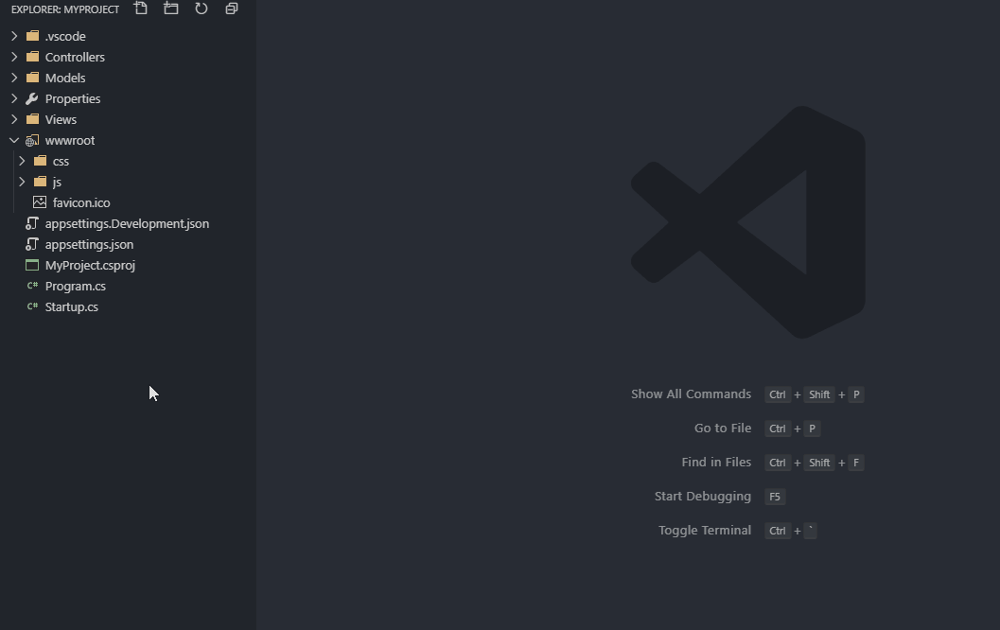

# LibMan Tools

Basic LibMan support for VSCode



## Features

- Package search on **cdnjs** and **npm** (for **jsdelivr** and **unpkg**).
- Interactive list of installed libraries for easy uninstalling.
- Explorer context menu shortcuts:
    - `LibMan: Init (via Terminal)`
    - `LibMan: Restore (via Terminal)`
    - `LibMan: Install (via Terminal)`
    - `LibMan: Uninstall (via Terminal)`
    - `LibMan: Clean (via Terminal)`
- `libman.json` autocompletion and validation through official JSON schema (https://docs.microsoft.com/en-us/aspnet/core/client-side/libman/libman-vs?view=aspnetcore-3.0#manually-configure-libman-manifest-file-entries).

## Requirements

- LibMan CLI (https://docs.microsoft.com/en-us/aspnet/core/client-side/libman/libman-cli)

To install LibMan CLI run:
```cmd
dotnet tool install --global Microsoft.Web.LibraryManager.Cli
```